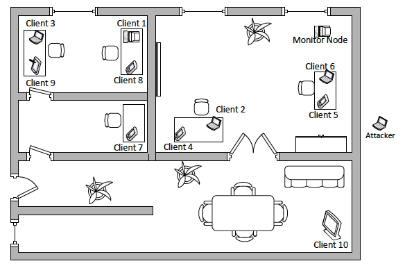

# BBK-Applied-ML
## Applied Machine Learning projects at Birkbeck Data Science MSc.
This is my first end-to-end ML project. The objective is to build a a Cyber Threat Detection system to distinguish between normal WiFi traffic and "bad" traffic or attacks. The attacks focussed on hereare impersonation attacks such as Hirte, Honeypot and EvilTwin.

My coursework uses the Aegean WiFi Intrusion/threat Dataset (AWID2). The creators of the dataset used a physical lab to replicate a typical SOHO (Small Office and Home) infratructure consisting of a nunmber of devices such as laptops, smartphones, tablets and smart Tvs. The data contains a wide range of cyber threats including impersonation attacks, i.e. an attack in which a cybercriminal assumes the identity of a legitimate party.

The coursework involves building a binary classifier capable of distinguishing between the normal and intrusive traffic that could form part of a ML-based wireless Intrusion Detection System (IDS).

The project will be completed on Google Colab.

## Elements of the project
* Download the dataset
	* There is a test and training dataset in csv format.
	The first row is the index number and can be removed.
	There should be 152 input variables and 1 target variable.

* Generating Features
	* Combine features generated by the chosen feature generati
	-on method with the original dataset e.g. Autoencoder, PCA
	and others.
	* Apply feature selection (e.g. filter, wrapper and embedd
	-ed and see if any of the generated features are selected.

* Building ML algorithms
	* Select candidate algorithms and discuss selection strateg
	-y. 
	* Fine-tune the algorithms to find the beste configuration
	of hyperparameters.

* Evaluating model and analysing results
	* Determine the accuracy, detection rate, false alarm, type
	II errors, MCC, TBM, TTM and use any other useful metrics
	* Discuss general model trade-offs and propose two models
	(e.g. features selected and ML classifiers)

